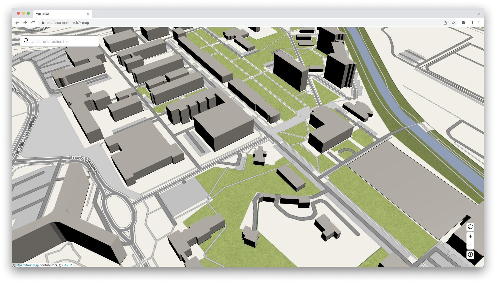

<h3 align="center">
    
    <br/>
	Map-INSA
</h3>

<p align="center">
  
</p>


## 🏗️ Ajouter / Modifier un bâtiment

- Rendez-vous sur [geojson.io](https://geojson.io/)
- Ouvrer le fichier [json/map.geojson](./json/map.geojson)
- Faites vos modifications
  > **Remplissez le tableau dans `Table` comme ceci**:
  > | name | short_name | description | height |
  > | ---- | ----------- | ---------- | ------ |
  > |      |             |            |        |

  > Pour récupérer la hauteur d'un bâtiment, vous pouvez vous rendre sur le site de [OSMBuildings](https://www.osmbuildings.org/) et cliquer sur le bâtiment en question.
- Enregistrez le fichier dans le dossier [json](./json) sous le nom `map.geojson`
- Ouvrez le fichier [js/buildins.js](./js/buildins.js) et copiez le contenu de `map.geojson` dans la variable `buildings` comme ceci :


```js
const buildings = COLLER LE CONTENU DE map.geojson ICI
```

